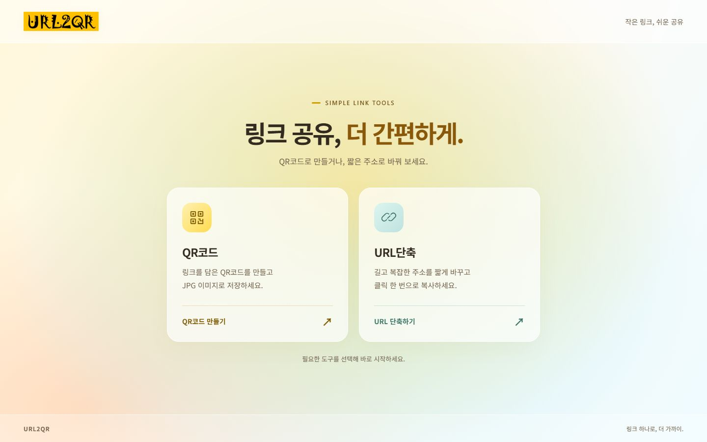
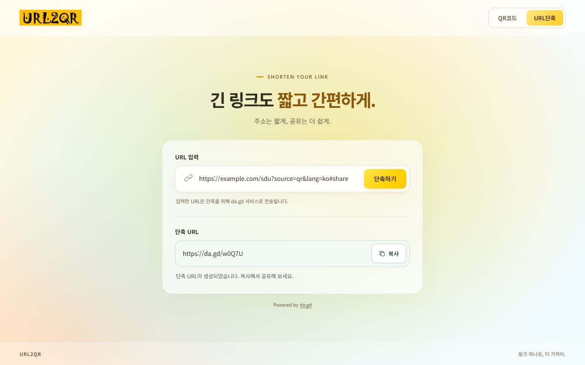

# 워크스루 — QR코드와 URL단축

## 완성 화면

## 사용 흐름

1. 메인에서 ‘QR코드’ 또는 ‘URL단축’을 선택한다.
2. QR코드는 url2qr/index.html에서 URL 입력 후 확인 또는 Enter로 만든다. 입력창이 하단으로 이동하며, QR을 누르면 JPG로 저장한다.
3. URL단축은 urlShort/index.html에서 URL을 입력하고 단축하기를 누른다. 빈 입력과 공백만 입력한 상태에서는 실행할 수 없다.
4. da.gd API의 응답을 읽기 전용 출력 상자에서 확인한다.
5. 복사를 누르면 클립보드에 저장되고 ‘복사하였습니다’ 알림이 나타난다.
6. 각 도구의 상단 메뉴로 전환하고 로고로 메인에 돌아온다.

## 구현 내용

- 루트 index.html은 도구 선택, url2qr은 기존 QR 기능, urlShort는 새 단축 기능을 맡는다.
- 공통 styles.css와 gradient.js로 밝은 테마와 커서 반응을 공유한다.
- 요청 중 실행과 입력을 잠그고 15초 시간 초과를 처리한다. HTTP 429에서는 1분 동안 재요청을 막는다.
- 결과를 수정할 수 없으며 입력을 바꾸면 이전 출력과 복사 상태를 초기화한다.
- 같은 페이지에서 같은 URL의 성공 결과는 메모리 캐시로 재사용한다.

## 검증 결과 — 2026-10-08

로컬 서버의 실제 Chromium 브라우저에서 35개 검증을 통과했다.

- 메인·도구 경로, 빈 값·공백의 버튼 비활성화, 읽기 전용 출력, 잘못된 프로토콜의 요청 전 거부.
- 실제 da.gd POST 요청 성공, 쿼리와 fragment 보존, 생성된 단축 URL의 원본 리디렉션 확인.
- 실제 클립보드 값과 ‘복사하였습니다’ 알림 확인. 같은 주소 재실행 시 API 추가 호출 없음.
- QR 생성·하단 입력 배치. 내려받은 JPEG가 1024 × 1024이며 독립 QR 판독 결과가 입력 주소와 일치함.
- 커서 반응과 동작 줄이기 설정, 320px·390px의 세 페이지 가로 넘침과 QR 결과 배치.
- 통제된 API 응답으로 처리 중 중복 실행 방지, URL 거부·네트워크·잘못된 응답·비정상 URL 처리, 60초 요청 제한, 15초 시간 초과 검증.
- Clipboard API를 사용할 수 없는 환경에서 대체 복사와 성공 알림 확인.
- 브라우저 JavaScript의 처리되지 않은 오류 없음.

추가 검증 3개도 통과했다: 320px 복사 버튼 한 줄 배치, 대체 복사 후 실제 붙여넣기 값 일치, 복사 권한 실패 시 성공 알림 없이 수동 복사 안내 표시. 기능 검증은 총 38개다.

실제 API 성공 검증: `https://example.com/sdu?source=qr&lang=ko#share` → `https://da.gd/w0Q7U`. 이 테스트 링크는 서비스의 외부 리디렉션을 사용한다.

기능 오류·시간 초과·사용 제한은 실제 제공자 장애를 유발하지 않고 브라우저 응답을 통제해 확인했다. 모바일 검증은 뷰포트 크기로 확인했으며 실제 기기 검증은 아니다. 내장 브라우저 도구가 이 PC의 잠긴 E: 드라이브 때문에 시작되지 않아 별도 Chromium 검증으로 실행했다.

검증 스크립트·JSON·다운로드는 Git에서 제외한 .verification 폴더에 보관했다. 공개 배포 파일에 테스트 결과나 개발 문서를 포함하지 않는다.

관련 문서: [프로젝트 개요](PROJECT_OVERVIEW.md), [기능명세서](FUNCTIONAL_SPEC.md), [구현 계획](implementation_plan.md), [작업 목록](task.md).
