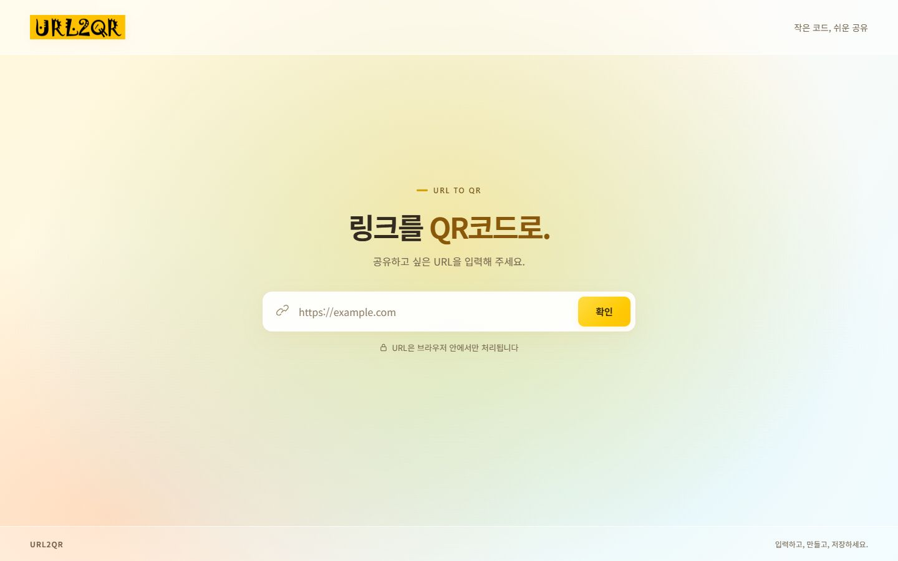

# 워크스루 — 밝은 그라데이션 테마

## 결과

노란 URL2QR 로고를 기준으로 밝은 노랑·살구·하늘색이 자연스럽게 섞이는 배경을 적용했다. 마우스 위치에 따라 빛의 중심과 색상이 부드럽게 달라진다.

## 구현 계획과 작업 목록

- [구현 계획](implementation_plan.md)
- [완료 작업 목록](task.md)

## 사용 흐름

1. 화면을 열면 밝은 그라데이션 위에 로고와 URL 입력창이 나타난다.
2. 마우스를 움직이면 노란 빛의 중심이 따라 움직이고, 노랑·살구·하늘색의 색조가 조금씩 달라진다.
3. 마우스를 멈추면 배경이 목표 위치에 부드럽게 도달한 뒤 정지한다.
4. URL을 입력하고 확인을 누르면 입력창이 아래로 이동하고 중앙에 QR코드가 나타난다.
5. QR코드를 클릭하면 JPG 다운로드를 시작한다.

## 변경 내용

| 파일 | 변경 내용 |
| --- | --- |
| `index.html` | 클릭을 가로채지 않는 장식용 배경 레이어와 제목의 황금색 포인트 |
| `styles.css` | 3개의 방사형 그라데이션과 바탕 그라데이션, 반투명 헤더·푸터, 흰 입력창, 노란 버튼 |
| `app.js` | 커서 좌표 정규화, CSS 변수 갱신, 시간 기반 보간, 정지 후 프레임 종료 |
| `README.md` | 테마 설명과 작업 문서 링크 |

### 커서 반응 방식

- 커서의 좌우 위치는 노란색을 39–53도 범위에서 바꾸며 빛의 중심을 좌우로 옮긴다.
- 상하 위치는 하늘색을 180–202도, 살구색을 20–32도 범위에서 바꾼다.
- 프레임마다 목표 값에 점진적으로 접근하고, 충분히 가까워지면 프레임 요청을 종료한다.
- 커서가 페이지를 떠나면 기본 중심점으로 돌아온다.
- 모바일 터치 환경, 동작 줄이기 설정, 숨겨진 탭에서는 동적인 반응을 멈춘다.

## 검증 결과

실제 내장 브라우저에서 다음을 확인했다.

- 커서 이동에 따라 CSS 그라데이션의 위치와 색조가 변한다.
- 두 상태의 스크린샷을 비교했을 때 실제 배경 픽셀이 변한다.
- 1440 × 900 화면에서 QR 생성 후 입력창이 QR 아래에 배치된다.
- 320 × 568, 390 × 844 화면에서 가로 넘침이 없다.
- 생성된 QR을 화면의 JPG 스크린샷에서 독립 QR 판독기로 읽었을 때 `https://example.com/bright`와 일치한다.
- QR 클릭 후 JPG 다운로드 시작 안내가 표시된다.

Node의 통제된 이벤트/프레임 검증 환경에서 다음을 확인했다.

- 빠른 포인터 이벤트가 하나의 대기 프레임을 공유한다.
- 위치와 색상이 바뀌고, 목표에 도달하면 프레임 요청이 끝난다.
- 포인터 이탈 시 기본값으로 돌아온다.
- 동작 줄이기 설정, 터치/거친 포인터, 숨겨진 탭, 창 포커스 해제 시 동작을 중단한다.

자동 검증은 7개 항목을 통과했다. JavaScript 문법 검사도 통과했다.

검증 자료:

- `.verification/gradient-report.json`: 자동 검증 결과와 환경
- `.verification/gradient-observation.json`: 실제 브라우저에서 읽은 그라데이션 값
- `.verification/gradient-desktop.jpg`: 초기 데스크톱 화면
- `.verification/gradient-result-desktop.jpg`: QR 생성 화면
- `.verification/gradient-mobile-320.jpg`, `.verification/gradient-mobile-390.jpg`: 모바일 크기 화면

검증 한계: 동작 줄이기와 터치 입력은 이벤트 검증 환경에서 확인했으며 실제 모바일 기기/운영체제 설정 변경을 통해 시험한 결과는 아니다. 내장 브라우저의 다운로드 이벤트가 파일 경로를 반환하지 않아 이번 변경에서는 저장된 JPG 파일 바이트를 다시 검증하지 못했다. QR 생성과 다운로드 구현은 이전 기능을 사용한다.

## 확인 방법

[http://localhost:4173](http://localhost:4173)을 열고 마우스를 움직인다. `index.html`을 직접 브라우저로 열어도 사용할 수 있다. 모든 소스와 문서는 `F:\moalab\SDU\프로젝트04`에 있다.
